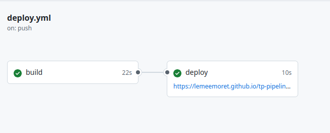

# Pipeline CI/CD : Angular, GitHub Actions et GitHub Pages

[](https://github.com/lemeemoret/tp-pipelining/actions/workflows/deploy.yml)

Application web Angular dont la qualité est vérifiée automatiquement sur chaque pull request et qui est déployée automatiquement sur GitHub Pages à chaque fusion dans `main`.

**Site en ligne : https://lemeemoret.github.io/tp-pipelining/**

Ce dépôt est le résultat d'un TP de DevOps sur le pipelining. L'application est volontairement minimale (un "Hello World" Angular) : l'objectif est le pipeline qui l'entoure, pas l'application.

## Fonctionnement


Le dépôt suit un flux de type **trunk based development** : `main` est la seule branche de référence, et tout changement passe par une branche courte et une pull request.

Exécution du workflow de déploiement après une fusion dans `main` :



## Les deux workflows

Ils sont définis dans [`.github/workflows/`](.github/workflows).

| Workflow | Déclencheur | Ce qu'il fait |
|---|---|---|
| [`lint.yml`](.github/workflows/lint.yml) | Pull request vers `main` (ouverture et chaque nouveau push) | Récupère le code, installe Node.js et les dépendances (`npm ci`), lance `ng lint`. Une erreur de lint fait échouer le check de la pull request. |
| [`deploy.yml`](.github/workflows/deploy.yml) | Push sur `main` (donc fusion d'une pull request), ou lancement manuel | Job `build` : installe les dépendances, compile avec `ng build`, publie le dossier compilé comme artefact. Job `deploy` : publie l'artefact sur GitHub Pages. |

Points notables :

- Le déploiement est découpé en deux jobs (`build` puis `deploy`), le second dépendant du premier avec `needs`.
- Le cache npm est activé et les dépendances sont installées avec `npm ci`, pour des builds reproductibles à partir de `package-lock.json`.
- Le workflow de déploiement utilise le jeton OIDC fourni par GitHub (permissions `pages: write` et `id-token: write`) : **aucun secret n'est stocké dans le dépôt**.
- Les permissions sont limitées au strict nécessaire, et un seul déploiement à la fois est autorisé (`concurrency`).
- L'application est compilée avec `--base-href /tp-pipelining/`, car le site est servi dans un sous-chemin de `github.io`.

## Structure du dépôt

```
.
├── .github/
│   └── workflows/
│       ├── lint.yml                  # vérification sur pull request
│       └── deploy.yml                # déploiement sur fusion dans main
└── first-app_01-hello-world/         # application Angular
    ├── angular.json
    ├── eslint.config.js              # configuration du lint
    ├── package.json
    ├── package-lock.json
    └── src/
```

## Lancer le projet en local

Prérequis : Node.js 22.22.3 ou plus récent (ou 24.15.0 ou plus récent), et npm.

```bash
cd first-app_01-hello-world
npm install
npx ng serve
```

L'application est alors disponible sur http://localhost:4200.

Pour reproduire en local ce que font les pipelines :

```bash
npx ng lint                                      # ce que fait lint.yml
npx ng build --base-href /tp-pipelining/         # ce que fait l'étape build de deploy.yml
```

## Contribuer à ce flux de travail

```bash
git switch -c feature/ma-modification
# ... modifications ...
git add .
git commit -m "Description du changement"
git push -u origin feature/ma-modification
```

Ouvrir ensuite une pull request vers `main`. Le check **Lint** se lance automatiquement. Une fois qu'il est vert, la fusion déclenche le déploiement du site.

## Technologies

- [Angular](https://angular.dev) et Angular CLI
- [angular-eslint](https://github.com/angular-eslint/angular-eslint) pour le lint
- [GitHub Actions](https://docs.github.com/en/actions) pour les pipelines
- [GitHub Pages](https://pages.github.com) pour l'hébergement